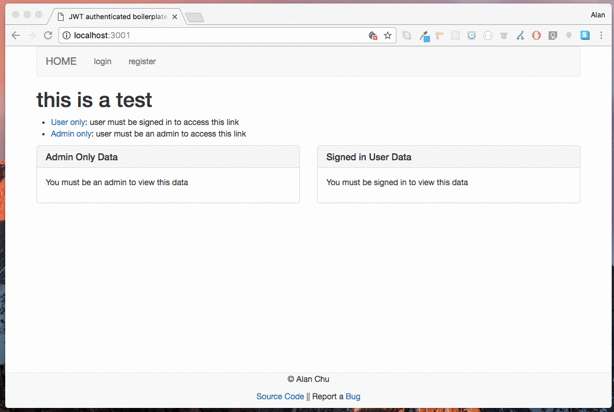

### jwt-auth-boilerplate
[](https://travis-ci.org/thechutrain/jwt-auth-boilerplate)

> a JWT authentication express.js boilerplate app built w./ handlebars + mongo

*View the deployed version of this repo [here](https://jwt-auth-boilerplate.herokuapp.com/)

Demo
------------



Getting Started
---------------
* make sure you have mongo db already installed, and have it running before starting the app. The mongo server can be started with `$ mongod`

```
$ git clone git@github.com:thechutrain/jwt-auth-boilerplate.git
$ cd jwt-auth-boilerplate/
$ git checkout -b origin/jwt-cookies-v1
$ npm install
$ npm run dev
```

Make sure to change the passphrase in the `.env` file in your root directory before deployment!!

* if you're using BASH, and not a zsh shell, you may get errors with the testing scripts if you don't take out the export statement in the test script commands in package.json

Deploying to Heroku
--------------------
* Make sure to have the cli-tools and a heroku account before you do the following steps:
1. `$ heroku create [your-app-name]`
2. go to [https://dashboard.heroku.com/apps](https://dashboard.heroku.com/apps)
3. Find your app, go to the 'Add-ons' section, and search for "mLab"
4. Provision a free "mLab MongoDB :: Mongodb"
5. `$ git push heroku origin/jwt-cookies-v1:master`

To Do // Tasks:
-------
* [x] project set up & readme.md
* [x] make a basic server.js page & install dependencies
* [x] create a basic mongo database file and get it set up properly 
* [x] create a separate mongo testing database
* [x] set up travis ci for mongo testing
* [x] add eslint w. standard `npm run lint --s`
* [x] set up bycrypt pre-save for user password
* [x] set up bycrypt pre-save for user password
* [x] save token in local storage
* [x] save token in cookies
* [ ] set up local strategy for passport.js
* [x] Deploy to Heroku

